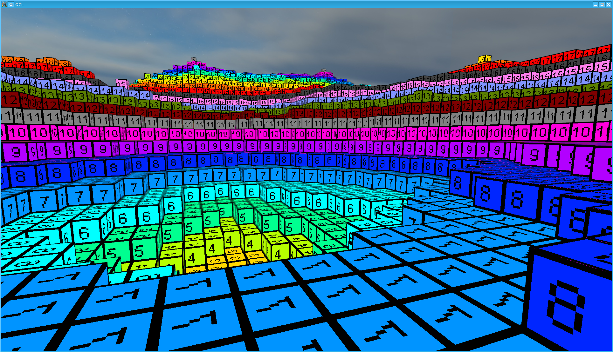
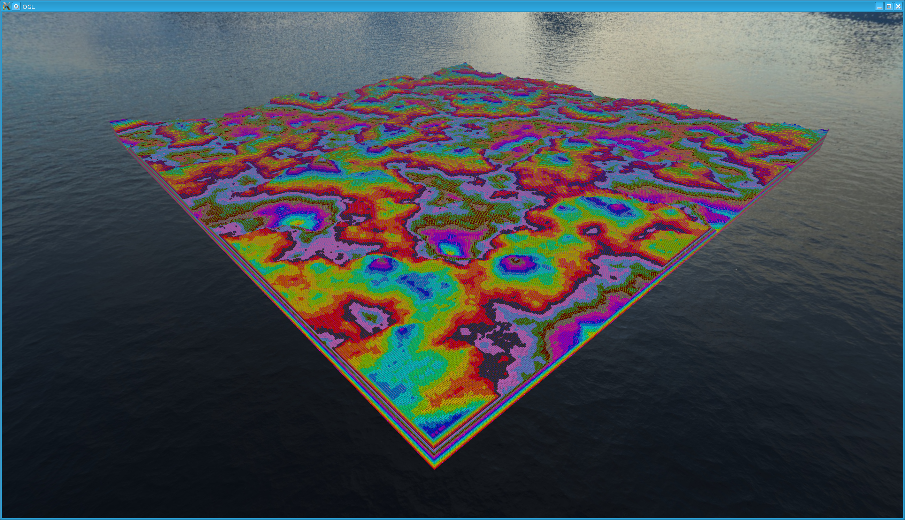
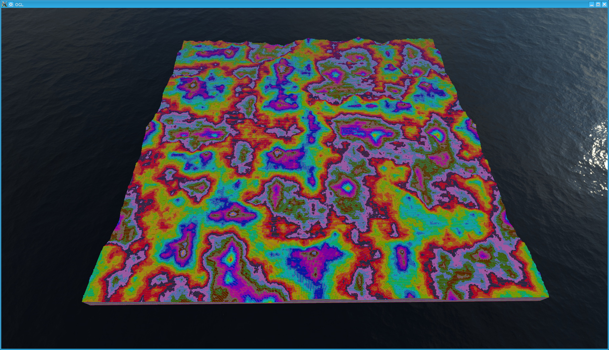

# OpenGL Cube-Based Engine 

## To Do List

### Features
* Simplified Context/Engine (Engine init, close...)
* Chunk Management
* Block Class
* Better BlockType Management
* Use libnoise : http://libnoise.sourceforge.net/tutorials/tutorial3.html
* Color Modification on Textures (Shader)
* Model Loading
* Model Animation
* Worlds : Save and Load
* Lua ?

### Performance Improvement
* /!\ Memory Leaks
* OpenGL Leaks ?
* Frustum Culling (Chunk)
* Mesh Simplification
* Messaging System for Mesh (Re)Calculation

## Ressources
* http://0fps.net/category/programming/voxels/
* https://sites.google.com/site/letsmakeavoxelengine/

* http://www.reddit.com/r/VoxelGameDev/comments/win15/the_big_list_of_block_engines_resources_continued/
